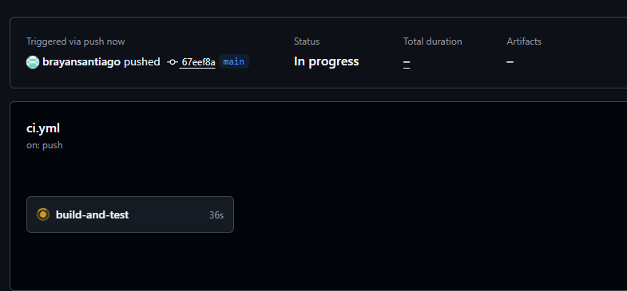
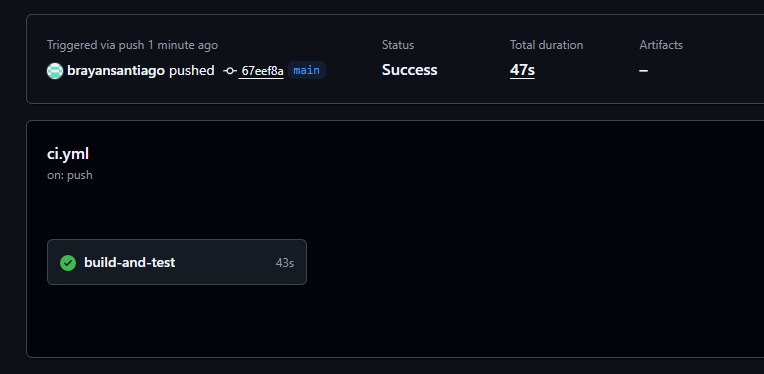
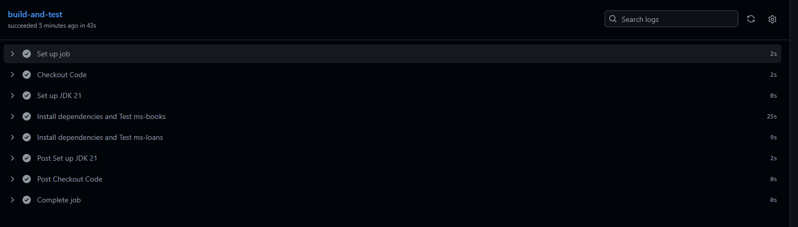
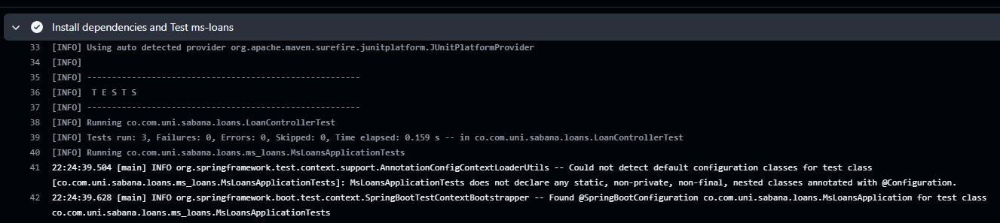
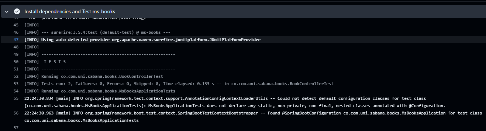
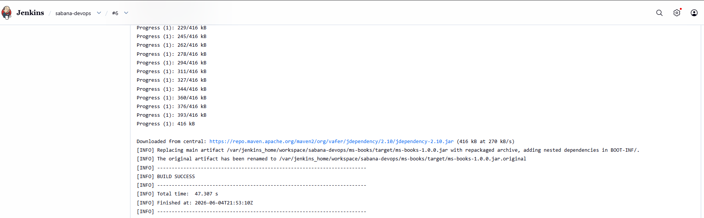
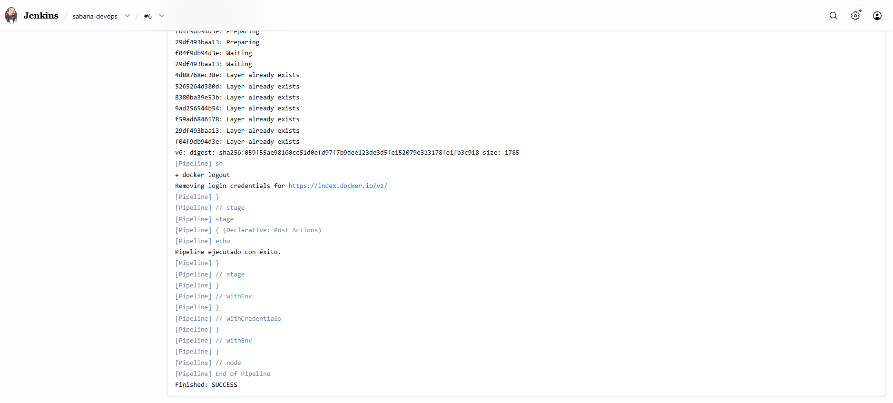
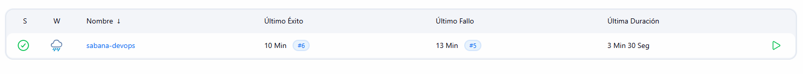
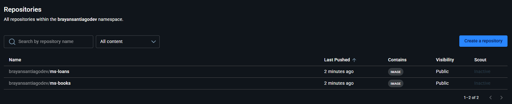

# CI/CD con GitHub Actions y Jenkins

Este repositorio contiene la configuración e implementación de dos pipelines Integración Continua con GitHub Actions y Entrega Continua con Jenkins aplicados a una arquitectura de microservicios.

## A. Estructura del Proyecto

El repositorio aloja dos microservicios Java construidos con Spring Boot:
- **`ms-books`**: Servicio para la gestión de libros.
- **`ms-loans`**: Servicio para el registro y gestión de préstamos.

Ambos microservicios cuentan con:
- Código fuente en `src/main/java`.
- Pruebas unitarias en `src/test/java`.
- Archivo `Dockerfile` para la contenedorización.

## B. Pipeline CI con GitHub Actions

**Archivo de configuración:** [`.github/workflows/ci.yml`](./.github/workflows/ci.yml)

El pipeline de Integración Continua garantiza que todo código nuevo esté validado antes de ser aceptado en la rama principal.

- **Disparador (Trigger):** Se ejecuta automáticamente ante cada evento `push` o `pull_request` hacia la rama `main`.
- **Flujo de Ejecución:**

1. **Checkout del Código:** Utiliza la acción `actions/checkout@v4` para descargar el repositorio.
2. **Configuración del Entorno:** Utiliza `actions/setup-java@v4` para instalar Java 21 (Temurin) e inicializar el caché de dependencias de Maven.
3. **Instalación y Pruebas - ms-books:** Se posiciona en la carpeta de `ms-books` y ejecuta las pruebas unitarias mediante `./mvnw clean test`.
4. **Instalación y Pruebas - ms-loans:** Se posiciona en la carpeta de `ms-loans` y ejecuta las pruebas unitarias mediante `./mvnw clean test`.

**Código del Pipeline:**

```yaml
name: CI Pipeline

on:
  push:
    branches:
      - main
  pull_request:
    branches:
      - main

jobs:
  build-and-test:
    runs-on: ubuntu-latest
    
    steps:
    - name: Checkout Code
      uses: actions/checkout@v4

    - name: Set up JDK 21
      uses: actions/setup-java@v4
      with:
        java-version: '21'
        distribution: 'temurin'
        cache: 'maven'

    - name: Install dependencies and Test ms-books
      working-directory: ./ms-books
      run: |
        chmod +x ./mvnw
        ./mvnw clean test

    - name: Install dependencies and Test ms-loans
      working-directory: ./ms-loans
      run: |
        chmod +x ./mvnw
        ./mvnw clean test
```

## C. Pipeline CD con Jenkins

**Archivo de configuración:** [`Jenkinsfile`](./Jenkinsfile)

El pipeline de Entrega Continua (CD) define el proceso automatizado para empaquetar la aplicación y preparar los artefactos Docker listos para el despliegue.

- **Flujo de Ejecución:**

1. **Clone Repository:** Descarga el código actualizado del repositorio desde el cual fue gatillado Jenkins.
2. **Build Maven:** Ejecuta la compilación y el empaquetado de los archivos JAR para ambos microservicios, omitiendo las pruebas (ya que fueron validadas en el CI). Comando: `./mvnw clean package -DskipTests`.
3. **Build Docker Images:** Construye las imágenes Docker utilizando los archivos `Dockerfile` presentes en la raíz de cada microservicio.
   - Etiqueta local: `brayansantiagodev/ms-books` y `brayansantiagodev/ms-loans`.
4. **Push to Registry:** Autentica la sesión de Jenkins con DockerHub utilizando credenciales seguras y publica las imágenes en el repositorio público bajo el usuario `brayansantiagodev`.

**Código del Pipeline:**

```groovy
pipeline {
    agent any

    environment {
        DOCKERHUB_CREDENTIALS = credentials('dockerhub-credentials-id')
        DOCKERHUB_USERNAME = 'brayansantiagodev'
        IMAGE_BOOKS = "${DOCKERHUB_USERNAME}/ms-books"
        IMAGE_LOANS = "${DOCKERHUB_USERNAME}/ms-loans"
        IMAGE_TAG = "v${env.BUILD_NUMBER}"
    }

    stages {
        stage('Clone Repository') {
            steps {
                echo 'Clonando el repositorio...'
                checkout scm
            }
        }

        stage('Build Maven') {
            steps {
                echo 'Compilando microservicios...'
                dir('ms-books') {
                    sh 'chmod +x ./mvnw'
                    sh './mvnw clean package -DskipTests'
                }
                dir('ms-loans') {
                    sh 'chmod +x ./mvnw'
                    sh './mvnw clean package -DskipTests'
                }
            }
        }

        stage('Build Docker Images') {
            steps {
                echo 'Construyendo imágenes de Docker...'
                dir('ms-books') {
                    sh "docker build -t ${IMAGE_BOOKS}:latest -t ${IMAGE_BOOKS}:${IMAGE_TAG} ."
                }
                dir('ms-loans') {
                    sh "docker build -t ${IMAGE_LOANS}:latest -t ${IMAGE_LOANS}:${IMAGE_TAG} ."
                }
            }
        }

        stage('Push to Registry') {
            steps {
                echo 'Subiendo imágenes a DockerHub...'
                sh "echo \$DOCKERHUB_CREDENTIALS_PSW | docker login -u \$DOCKERHUB_CREDENTIALS_USR --password-stdin"
                sh "docker push ${IMAGE_BOOKS}:latest"
                sh "docker push ${IMAGE_BOOKS}:${IMAGE_TAG}"
                sh "docker push ${IMAGE_LOANS}:latest"
                sh "docker push ${IMAGE_LOANS}:${IMAGE_TAG}"
                sh "docker logout"
            }
        }
    }

    post {
        success {
            echo 'Pipeline ejecutado con éxito.'
        }
        failure {
            echo 'El pipeline falló.'
        }
    }
}
```

## Evidencias

### 1. Ejecución Exitosa: GitHub Actions (CI)






### 2. Ejecución Exitosa: Jenkins (CD)




### 3. Imágenes en DockerHub

